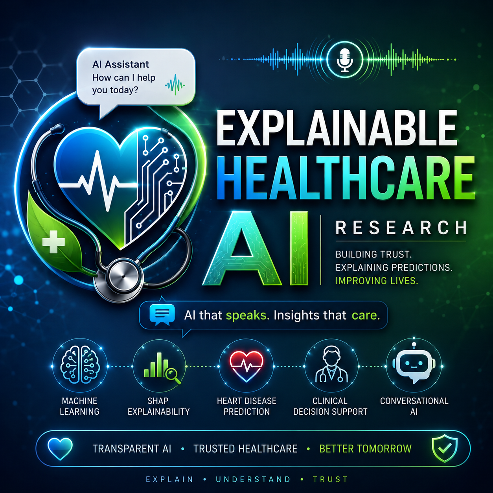

# Explainable Healthcare AI Research

  

  <b>Explainable AI for Trustworthy Healthcare Systems</b>

---

# Vision

Building trustworthy and explainable healthcare AI systems for heart disease prediction and clinical decision support.

---

# Project Overview

This research project focuses on developing Explainable Artificial Intelligence (XAI)-based healthcare systems capable of supporting transparent and trustworthy clinical decision-making.

The system integrates:
- Machine Learning
- SHAP Explainability
- Clinical Decision Support
- Conversational Healthcare AI
- Medical Knowledge Retrieval
- Transparent Prediction Systems

The long-term goal is to build scalable and ethical healthcare AI infrastructure for Nepal and future global healthcare deployment.

---

# System Architecture

  

---

# Problem Statement

Many healthcare AI systems operate as black-box models and fail to explain predictions clearly to healthcare professionals.

Lack of interpretability reduces:
- Trust
- Transparency
- Clinical adoption

This project aims to solve these issues through Explainable AI.

---

# Core Technologies

- Python
- Machine Learning
- Explainable AI (XAI)
- SHAP Explainability
- Random Forest
- XGBoost
- Deep Learning
- Clinical AI
- Conversational AI
- Healthcare Analytics

---

# Proposed Workflow

Patient Data  
↓  
Preprocessing  
↓  
Feature Extraction  
↓  
Machine Learning Prediction  
↓  
SHAP Explainability  
↓  
Clinical Recommendations  
↓  
Trustworthy Healthcare Insights

---

# Repository Structure

architecture/ → System architecture diagrams  
datasets/ → Healthcare datasets  
docs/ → Research documentation and roadmap  
notebooks/ → Machine learning and SHAP experiments  
ppt/ → Faculty and startup presentations  
screenshots/ → Dashboard previews and visual outputs  
future_vision/ → Future healthcare AI expansion plans

---

# Future Scope

- ECG Explainability
- Medical Imaging AI
- Federated Learning
- Conversational Clinical AI
- Hospital Integration
- Real-time Monitoring
- AI Research Lab Development
- Nationwide Healthcare AI Deployment in Nepal

---

# Long-Term Mission

To create transparent, ethical, and trustworthy healthcare AI systems capable of supporting doctors, researchers, hospitals, and patients through explainable clinical intelligence.

---

# Research Focus

- Explainable AI in Healthcare
- Heart Disease Prediction
- Trustworthy Clinical AI
- AI Governance
- Medical Decision Support Systems
- Ethical Healthcare AI

---

# Current Status

Current Phase:
Research Architecture & Initial Development

Upcoming Phase:
Dataset Collection and SHAP-based Model Development

---

# Contributions

This project is currently under active research and development.

Future collaborations, healthcare AI discussions, and research partnerships are welcome.
